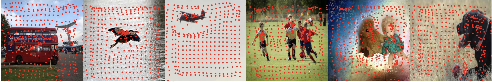

# Xingyu Chen


CV&AI Research at Y-tech, Kuaishou Technology
<br/>[Google Scholar](https://scholar.google.com/citations?user=YurWtIEAAAAJ&hl)
[CV in English]()
[CV in Chinese]()
<br/>[Github](https://github.com/SeanChenxy)</br>

### Research Interests

Object detection, tracking, 3D human/object/scene understanding.

### News

**2021/3/1** Had one paper accepted by CVPR 2021 about monocular hand reconstruction.

**2021/3/1** Our book [Visual Perception and Control of Underwater Robots](https://www.routledge.com/Visual-Perception-and-Control-of-Underwater-Robots/Yu-Chen-Kong/p/book/9780367695781) was published .

### Publications (Selected)

**Camera-Space Hand Mesh Recovery via Semantic Aggregation and Adaptive 2D-1D Registration**
<p align="left">

</p>

in *CVPR21*
Xingyu Chen, Yufeng Liu, Chongyang Ma, *et al.*
[arXiv](https://arxiv.org/pdf/2103.02845.pdf) [Github](https://github.com/SeanChenxy/HandMesh)

**Joint Anchor-Feature Refinement for Real-Time Accurate Object Detection in Images and Videos**
<p align="left">

</p>

in *TCSVT21*
Xingyu Chen, Junzhi Yu, Shihan Kong, Zhengxing Wu, and Li Wen.
[arXiv](https://arxiv.org/pdf/1807.08638.pdf) [Github](https://github.com/SeanChenxy/TDRN)

**A Soft Manipulator for Efficient Delicate Grasping in Shallow Water: Modeling, Control, and Real-World experiments**
in *IJRR20*
Zheyuan Gong , Xi Fang , Xingyu Chen, et al.
[paper](https://softrobotics.buaa.edu.cn/Download/2020/2020-IJRR-Gongzheyuan.pdf)

**Temporally identity-aware SSD with attentional LSTM**
in *TCYB20*
Xingyu Chen, Junzhi Yu, and Zhengxing Wu.
[arXiv](https://arxiv.org/pdf/1803.00197.pdf) [Github](https://github.com/SeanChenxy/TSSD-OTA)

**Towards real-time advancement of underwater visual quality with GAN**
<p align="left">

</p>

in *TIE19*
Xingyu Chen, Junzhi Yu, Shihan Kong, Zhengxing Wu, Xi Fang, and Li Wen.
[arXiv](https://arxiv.org/pdf/1712.00736.pdf) [Github](https://github.com/SeanChenxy/GAN_RS)


### Technical Reports

**Reveal of Domain Effect: How Visual Restoration Contributes to Object Detection in Aquatic Scenes**
Xingyu Chen, Yue Lu, Zhengxing Wu, Junzhi Yu, and Li Wen.
[arXiv](https://arxiv.org/pdf/2003.01913.pdf)

**Rethinking Temporal Object Detection from Robotic Perspectives**
Xingyu Chen, Zhengxing Wu, Junzhi Yu, and Li Wen.
[arXiv](https://arxiv.org/pdf/1912.10406.pdf)


## Welcome to GitHub Pages

You can use the [editor on GitHub](https://github.com/SeanChenxy/seanchenxy.github.io/edit/main/index.md) to maintain and preview the content for your website in Markdown files.

Whenever you commit to this repository, GitHub Pages will run [Jekyll](https://jekyllrb.com/) to rebuild the pages in your site, from the content in your Markdown files.

### Markdown

Markdown is a lightweight and easy-to-use syntax for styling your writing. It includes conventions for

```markdown
Syntax highlighted code block

# Header 1
## Header 2
### Header 3

- Bulleted
- List

1. Numbered
2. List

**Bold** and _Italic_ and `Code` text

[Link](url) and 
```

For more details see [GitHub Flavored Markdown](https://guides.github.com/features/mastering-markdown/).

### Jekyll Themes

Your Pages site will use the layout and styles from the Jekyll theme you have selected in your [repository settings](https://github.com/SeanChenxy/seanchenxy.github.io/settings). The name of this theme is saved in the Jekyll `_config.yml` configuration file.

### Support or Contact

Having trouble with Pages? Check out our [documentation](https://docs.github.com/categories/github-pages-basics/) or [contact support](https://support.github.com/contact) and we’ll help you sort it out.