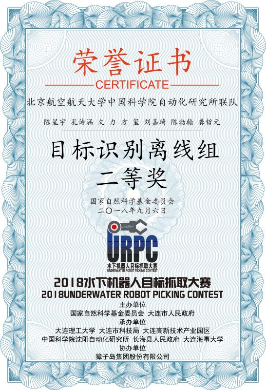

# Xingyu Chen

CV&AI Researcher at Y-tech, Kuaishou Technology
 Email: chenxy.sean@gmail.com 

&emsp;I'm currently a researcher at Y-tech, Kuaishou Technology (Kwai Inc.). 
  &emsp;I obtained my Ph.D. in Automation from Institute of Automation, Chinese 
  &emsp;Academy of Science in 2020, under the supervision of Prof. [Junzhi Yu](https://scholar.google.com/citations?user=Gudfky4AAAAJ&hl=en). 
  &emsp;Previously I received my B.S. in Electrical Engineering and Automation from
  &emsp;Chengdu University of Technology in 2015.

&emsp;[Google Scholar](https://scholar.google.com/citations?user=YurWtIEAAAAJ&hl) /
 [CV](https://drive.google.com/drive/folders/1WSxGNGf9ZMyYit4Lz_5BI8u58FIfa_MP?usp=sharing) /
 [Github](https://github.com/SeanChenxy) / 
 [Zhihu](https://www.zhihu.com/people/chen-xing-yu-62-89)

 
### Research Interests

I have been focusing on object detection/tracking for underwater robotics since I started my PhD in 2015. My reseach interests lie in the joint field of robotics and computer vision, including but not limited to scene perception, 3D human/object/scene understanding, and human-machine interaction.

### News
**2022/3/2** Had one paper accepted by CVPR 2022 about monocular hand reconstruction.
 **2022/2/25** Had one paper accepted by IEEE Transactions on Cybernetics about few-shot object detection.
 **2021/9/1** [Hand3DResearch](https://github.com/SeanChenxy/Hand3DResearch) was released to track recent works in 3D hand tasks.
 **2021/3/1** Had one paper accepted by CVPR 2021 about monocular hand reconstruction.
 **2021/3/1** Our book [Visual Perception and Control of Underwater Robots](https://www.routledge.com/Visual-Perception-and-Control-of-Underwater-Robots/Yu-Chen-Kong/p/book/9780367695781) was published .

### Experience

 

&emsp;&emsp;&emsp;&emsp;&emsp;&emsp;&emsp;&ensp;CV&AI Researcher, [Kuaishou Technology](https://www.kwai.com/) 
 &emsp;&emsp;&emsp;&emsp;&emsp;&emsp;&emsp;&ensp;&nbsp;Jul. 2020 ~ Present

 

&emsp; Ph.D., [Institute of Automation Chinese Academy of Sciences](http://english.ia.cas.cn/) 
 &emsp; Sep. 2015 ~ Jul. 2020

### Publications (Selected)

**MobRecon: Mobile-Friendly Hand Mesh Reconstruction from Monocular Image**

in *CVPR22*
 Xingyu Chen, Yufeng Liu, Yajiao Dong, *et al.*
 [arXiv](https://arxiv.org/pdf/2112.02753.pdf), [Github](https://github.com/SeanChenxy/HandMesh)

**Camera-Space Hand Mesh Recovery via Semantic Aggregation and Adaptive 2D-1D Registration**

in *CVPR21*
 Xingyu Chen, Yufeng Liu, Chongyang Ma, *et al.*
 [arXiv](https://arxiv.org/pdf/2103.02845.pdf), [Github](https://github.com/SeanChenxy/HandMesh)

**Joint Anchor-Feature Refinement for Real-Time Accurate Object Detection in Images and Videos**

in *TCSVT*
 Xingyu Chen, Junzhi Yu, Shihan Kong, Zhengxing Wu, and Li Wen.
 [arXiv](https://arxiv.org/pdf/1807.08638.pdf), [Github](https://github.com/SeanChenxy/TDRN)

**A Soft Manipulator for Efficient Delicate Grasping in Shallow Water: Modeling, Control, and Real-World experiments**
 in *IJRR*
 Zheyuan Gong , Xi Fang , Xingyu Chen, et al.
 [paper](https://softrobotics.buaa.edu.cn/Download/2020/2020-IJRR-Gongzheyuan.pdf)

**Temporally identity-aware SSD with attentional LSTM**
 in *TCYB*
 Xingyu Chen, Junzhi Yu, and Zhengxing Wu.
 [arXiv](https://arxiv.org/pdf/1803.00197.pdf), [Github](https://github.com/SeanChenxy/TSSD-OTA)

**Towards real-time advancement of underwater visual quality with GAN**

in *TIE*
 Xingyu Chen, Junzhi Yu, Shihan Kong, Zhengxing Wu, Xi Fang, and Li Wen.
 [arXiv](https://arxiv.org/pdf/1712.00736.pdf), [Github](https://github.com/SeanChenxy/GAN_RS)

### Technical Reports

**Reveal of Domain Effect: How Visual Restoration Contributes to Object Detection in Aquatic Scenes**
 Xingyu Chen, Yue Lu, Zhengxing Wu, Junzhi Yu, and Li Wen.
[ arXiv](https://arxiv.org/pdf/2003.01913.pdf)

**Rethinking Temporal Object Detection from Robotic Perspectives**
 Xingyu Chen, Zhengxing Wu, Junzhi Yu, and Li Wen.
 [arXiv](https://arxiv.org/pdf/1912.10406.pdf)

### Honors

    

    

    

### Service
A reviewer for CVPR22, MM21, CVPR21, ICRA20, IROS20, ICRA19, IROS19, TCYB, TCSVT, and so on.

### Hobby

I love to play Nintendo Switch. Zelda is my favorite games, and I am skilled at playing PES and NBA 2K. I also like the infectious Spiritfarer.
 I’m also interested in making music with guitar. See my [podcast]( https://music.163.com/#/radio?id=794486541) in NetEase Music.
 My record for the 1000-meter freestyle swim reaches 27'08''.

